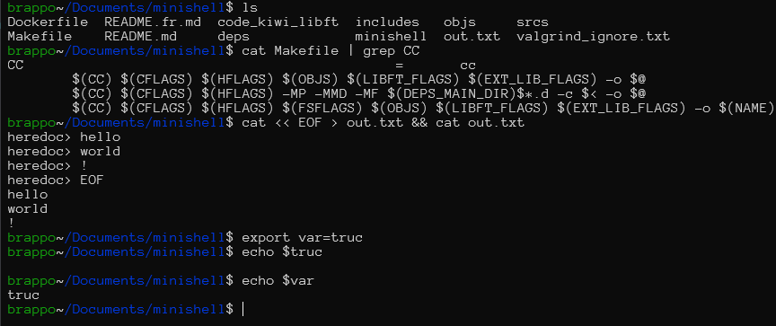
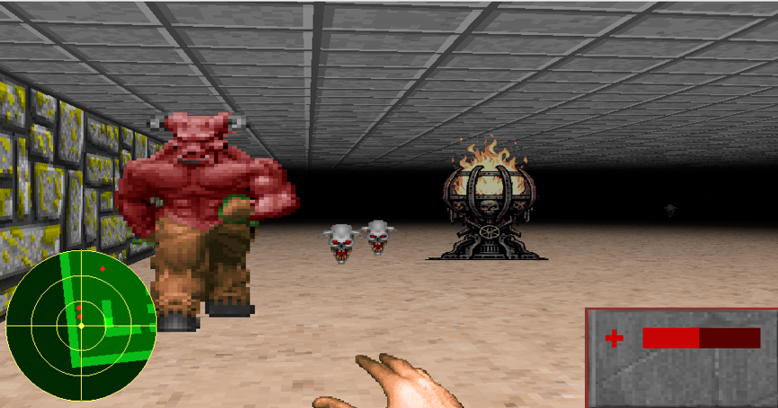
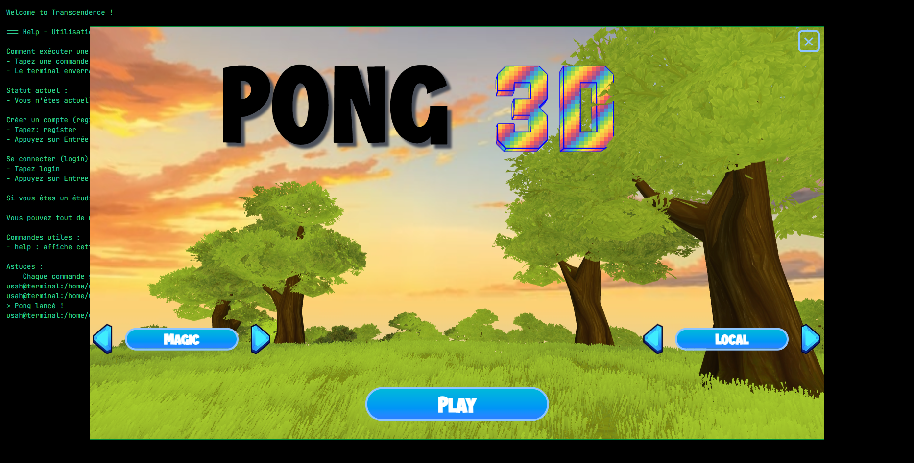

<!DOCTYPE html>
<html>
	<head>
		<meta charset="utf-8">
        <title>Portfolio</title>
        <link rel="stylesheet" href="portfolio.css">
        <link rel="stylesheet" href="resume.css">
        <link rel="stylesheet" href="cards.css">
        
	</head>
	<body>
        

			
			
Développeur depuis le collège, je me passionne pour le C/C++ et la programmation graphique. Je vous présente 4 projets parmis la vingtaine que j'ai développés durant ma formation.

			<button>View Resume</button>
		

		

			

				
				<h2>LINUX APP</h2>
				<h1>Minishell</h1>
				
<mark style="background-color: #F39B6DB4;">C</mark>

				
Un programme qui permet d’interagir avec l’ordinateur en ligne de commande, comme un terminal classique. Il reproduit les fonctionnalités essentielles pour naviguer et exécuter des commandes.

				<button>View More</button>
			

			

				
				<h2>LINUX APP</h2>
				<h1>Cub3d</h1>
				
<mark style="background-color: #F39B6DB4;">C</mark>

				
Un serveur capable de faire fonctionner un site web en répondant aux requêtes des utilisateurs. Il gère l’affichage des pages, les fichiers et les interactions de base sur internet.

				<button>View More</button>
			

			

				
				<h2>LINUX APP</h2>
				<h1>Webserv</h1>
				
<mark style="background-color: #FF0046B4;">C++</mark>

				
Un site internet interactif comprenant un jeu vidéo jouable à plusieurs, avec création de comptes et sauvegarde des données. Les utilisateurs peuvent s’inscrire, jouer et retrouver leur progression.

				<button>View More</button>
			

			

				
				<h2>WEB APP</h2>
				<h1>Transcendence</h1>
				

					<mark style="background-color: #61a1d7B4;">TYPESCRIPT</mark>
					<mark style="background-color: #FFB703B4;">TAILWINDCSS</mark>
					<mark style="background-color: #ECE4B7B4;">SQLITE</mark>
					<mark style="background-color: #1789FCB4;">FASTIFY</mark>
				

				
Un jeu inspiré des premiers jeux de tir comme Doom, avec un rendu en 3D simplifiée. Le joueur évolue dans un environnement immersif vu à la première personne.

				<button>View More</button>
			

		

        

			<svg width="100%" height="100%" viewBox="0 0 24 24" fill="none" xmlns="http://www.w3.org/2000/svg">
			 <path d="M15 18L9 12L15 6" stroke="currentColor" stroke-width="2" stroke-linecap="round" stroke-linejoin="round"/>
			 </svg>
			

			<svg width="100%" height="100%" viewBox="0 0 24 24" fill="none" xmlns="http://www.w3.org/2000/svg">
			 <path d="M9 18L15 12L9 6" stroke="currentColor" stroke-width="2" stroke-linecap="round" stroke-linejoin="round"/>
			 </svg>
		

	</body>
</html>
